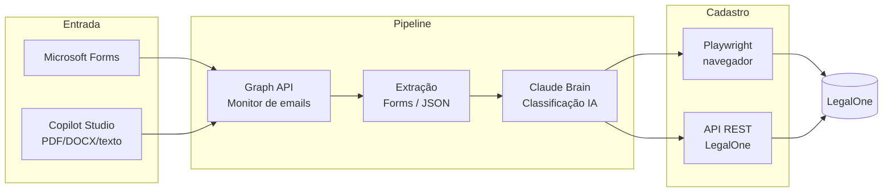

<div align="center">


<br/><br/>

**Cadastro automático de processos judiciais no LegalOne a partir de petições.**

Recebe dados via Microsoft Forms ou agente Copilot Studio, classifica com IA e cadastra no LegalOne via navegador (Playwright) ou API REST.

[](https://www.python.org/)
[](https://playwright.dev/python/)
[](https://fastapi.tiangolo.com/)
[](https://github.com/PaolloSc/automacao-legalone/actions/workflows/ci.yml)
[](LICENSE)
[](https://github.com/astral-sh/ruff)

</div>

---

## 📑 Índice

- [Visão Geral](#-visão-geral)
- [Arquitetura](#-arquitetura)
- [Duas Opções de Entrada](#-duas-opções-de-entrada)
- [Tipos de Cadastro](#-tipos-de-cadastro)
- [O que o bot preenche sozinho](#-o-que-o-bot-preenche-sozinho)
- [Jurimetria e risco](#-jurimetria-e-risco)
- [Setup](#-setup)
- [Variáveis de Ambiente](#-variáveis-de-ambiente)
- [Operação do dia a dia](#-operação-do-dia-a-dia)
- [Armadilhas conhecidas](#-armadilhas-conhecidas)
- [Estrutura do Projeto](#-estrutura-do-projeto)
- [Testes](#-testes)
- [Segurança & LGPD](#-segurança--lgpd)
- [Licença](#-licença)

---

## 🎯 Visão Geral

O gargalo do cadastro de processos é a **entrada manual de dados**. Este projeto automatiza todo o fluxo: do recebimento dos dados da petição até o cadastro final no LegalOne, com classificação inteligente do tipo de tarefa pelo caminho.

| Antes | Depois |
|-------|--------|
| Advogado preenche formulário manualmente | Envia PDF/DOCX ou conversa com o agente |
| Operador copia dados pro LegalOne | Bot cadastra sozinho |
| Sem classificação | IA identifica tipo de tarefa |
| ~15 min por processo | ~2 min, sem intervenção |

---

## 🏗 Arquitetura



**Fluxo resumido:**

1. **Entrada** — Microsoft Forms **ou** agente Copilot Studio (chat aceita PDF/DOCX/DOC/texto)
2. **Monitor** — `outlook_monitor_graph.py` lê emails via Microsoft Graph API
3. **Extração** — `forms_extractor.py` (Forms) ou JSON direto (Copilot)
4. **Classificação** — `claude_brain.py` identifica o tipo de tarefa
5. **Enriquecimento** — `datajud_client.py` busca a capa do processo no CNJ pelo
   número (ver [O que o bot preenche sozinho](#-o-que-o-bot-preenche-sozinho))
6. **Cadastro** — `legalone_cadastro.py` (Playwright) ou `legalone_api_cadastro.py` (REST)

> [!IMPORTANT]
> A origem (Forms ou Copilot) existe **só** em `automacao_legalone_completa.py`,
> onde se decide *como obter* os dados. Do `dados_processo` em diante o
> caminho é único — `legalone_cadastro.py` não sabe de onde o dado veio.
> Garantido por `tests/test_capa_independe_da_origem.py`.

---

## 🔀 Duas Opções de Entrada

<table>
<tr>
<th>Opção A — Copilot Studio</th>
<th>Opção B — Webhook OCR</th>
</tr>
<tr>
<td>

Agente extrai campos via LLM, advogado revisa no chat, Power Automate envia email estruturado para o bot.

**Vantagem:** interface conversacional, zero código pro usuário final.

📄 [`docs/COPILOT_AGENTE.md`](docs/COPILOT_AGENTE.md)

</td>
<td>

`peticao_api.py` (FastAPI) recebe PDF/DOCX/DOC → Azure Document Intelligence (OCR) → Groq Llama (extração) → cadastro direto.

**Vantagem:** elimina dependência de email, totalmente automático.

</td>
</tr>
</table>

---

## 📋 Tipos de Cadastro

Suporta 5 tipos, cada um com seus campos específicos (ver [`forms_mapping.py`](forms_mapping.py)):

| Tipo | Descrição |
|------|-----------|
| 🟢 `CADASTRO INICIAL` | Processo novo |
| 🔵 `DECISOES` | Decisão em processo existente |
| 🟡 `RECURSO` | Interposição de recurso |
| ⚫ `ARQUIVAMENTO COMPLETO` | Encerramento total |
| ⚪ `ARQUIVAMENTO SIMPLES` | Baixa administrativa |

---

## 🧭 O que o bot preenche sozinho

Não peça no Forms nem no chat do agente o que o tribunal já publicou. Com o
**número CNJ** em mãos, o bot busca a capa do processo na API pública do
DataJud/CNJ (`datajud_client.py`) — uma requisição, a mesma para todos os
campos abaixo — e preenche **só o que chegar vazio**:

| Campo na ficha | De onde sai |
|---|---|
| `Justiça (CNJ)` | dígito J do próprio número (8=Estadual, 5=Trabalho, 4=Federal…) |
| `Instância (CNJ)` | `grau` (G1/G2) |
| `Classe (CNJ)` | `classe.nome` (código TPU junto) |
| `Assunto (CNJ)` | assunto principal — lista repetível `Assuntos_<guid>__AssuntoText` |
| `Vara/turma` | `orgaoJulgador.nome` |
| `Data da distribuição` | `dataAjuizamento` |
| `Risco` | tabela de jurimetria, pelo **código TPU** do assunto |

> [!NOTE]
> O índice público **não traz** partes, advogados nem valor da causa — isso
> continua vindo da petição. E sem CNJ válido não há capa: por isso o agente
> pergunta o número em vez de mandar `NAO LOCALIZADO` (petição inicial ainda
> não protocolada não tem número).

---

## 📊 Jurimetria e risco

O `risco` não é chute nem cópia do que a peça afirma. `jurimetria_datajud.py`
mede no DataJud, por tribunal, **quantos processos com aquele assunto foram
julgados improcedentes** e grava uma tabela em `docs/jurimetria/`:

```bash
python jurimetria_datajud.py --todos --refazer   # todos os tribunais (leva horas)
python jurimetria_datajud.py trt3 tjmg           # só alguns
python jurimetria_datajud.py --demo              # self-check, sem rede
```

| Decisão | Por quê |
|---|---|
| Arquivo, não consulta ao vivo | metade das chamadas ao DataJud volta 429/504, e a taxa é estatística estável |
| Corte por **tercil** da própria distribuição | TJMG rejeita 24% e TRF6 rejeita 38%: limiar fixo classificaria o TRF6 inteiro como risco alto |
| Amostra mínima de 500 decididos | abaixo disso a porcentagem é ruído |
| Casamento pelo **código TPU**, não pelo nome | "Horas in Itinere" aparece com três grafias entre tribunal e petição |

Quem lê a tabela em produção é `jurimetria_risco.py` — só leitura de arquivo,
sem rede. O agente do Copilot mostra o risco na conversa; **quem grava no
LegalOne é o bot**, pelo código, e a divergência sai no log:

```
[DATAJUD] risco do agente 'Alto' -> 'Medio' (codigo TPU do assunto)
```

Dois limites que precisam estar claros para quem lê o número: o movimento de
sentença é do **processo**, não do pedido (~70% das trabalhistas são
"procedente em parte"); e só vale para pedido **contencioso** — inventário e
divórcio consensual aparecem como risco alto sem significar nada.

---

## 🚀 Setup

```bash
# 1. Instalar dependências
pip install -r requirements.txt
playwright install chromium

# 2. Configurar credenciais
cp .env.example .env
# editar .env com seus valores

# 3. Rodar
python automacao_legalone_completa.py
```

> [!TIP]
> Para a **Opção B** (webhook OCR), suba a API com:
> ```bash
> uvicorn peticao_api:app --host 0.0.0.0 --port 8000
> ```

---

## 🔑 Variáveis de Ambiente

Ver [`.env.example`](.env.example). Principais:

| Variável | Uso |
|----------|-----|
| `LEGALONE_USERNAME` / `LEGALONE_PASSWORD` | Login LegalOne |
| `AZURE_TENANT_ID` / `AZURE_CLIENT_ID` / `AZURE_CLIENT_SECRET` | Graph API (emails) |
| `GROQ_API_KEY` | Extração via LLM (grátis) |
| `FIRECRAWL_API_KEY` | Scraping Forms (opcional) |
| `AZURE_DOC_INTELLIGENCE_*` | OCR Opção B |
| `DATAJUD_API_KEY` | Override da chave pública do CNJ (opcional) |
| `LEGALONE_ERROR_EMAIL_TO` | Quem recebe erro **e** sucesso (lista separada por vírgula) |
| `GRAPH_JANELA_MINUTOS` | Quanto tempo para trás o monitor olha (padrão 1440) |
| `LEGALONE_HEADLESS` | `1` roda sem janela; qualquer outra coisa abre o Chrome |
| `FORMS_RESPOSTA_FIXA` | Trava o extrator numa resposta específica do Forms — para reprocessar |
| `FORMS_RESPOSTA_MINIMA` | Piso da busca pela última resposta; sobrepõe o `resposta_minima` do formulário em `FORMS_TIPOS` (trabalhista 830, cível 232) |

> [!WARNING]
> Nunca commite o `.env`. Ele está no `.gitignore` por padrão.

---

## 🖥 Operação do dia a dia

**No PC do escritório** — `scripts/iniciar_automacao.bat` é supervisor: se o
Python cair, ele sobe de novo em 30s. Para reiniciar com código novo, basta
matar o processo Python; o `.bat` faz o resto.

```powershell
# reiniciar (o supervisor recria em ~30s)
Get-CimInstance Win32_Process -Filter "Name like '%python%' and CommandLine like '%automacao_legalone_completa%'" |
  ForEach-Object { Stop-Process -Id $_.ProcessId -Force }
```

**Na VM** — `sudo systemctl restart legalone` · `journalctl -u legalone -f`

**Logs:** `outlook_monitor.log` (tudo), `automacao_legalone.log` (resumo),
`processos_erro.log` (payload completo de cada falha).

### Reprocessar um e-mail já visto

O e-mail entra em `graph_processed_emails.json` **quando o Graph o entrega**,
não quando o cadastro dá certo — um ciclo que falha consome o e-mail do mesmo
jeito. Para trazê-lo de volta:

```bash
python scripts/retrigger_email.py                    # lista o que está marcado
python scripts/retrigger_email.py --desmarcar <trecho>
```

> [!CAUTION]
> O serviço guarda o estado **em memória** e reescreve o arquivo a cada ciclo.
> Editar o JSON com o bot vivo não adianta: pare o processo (e o supervisor),
> edite, e só então deixe subir.

### Reprocessar uma resposta específica do Forms

O e-mail do Forms não diz qual resposta é a dele, e a busca normal cai sempre
na última. Para mirar uma:

```bash
FORMS_RESPOSTA_FIXA=839 python automacao_legalone_completa.py
```

> [!WARNING]
> Rode isso **fora** do supervisor e volte ao normal depois — com a trava
> ligada, o próximo e-mail que chegar também seria extraído da resposta 839.

---

## 🧨 Armadilhas conhecidas

Cada uma custou uma investigação; estão aqui para não custarem duas.

| Sintoma | Causa | Onde |
|---|---|---|
| Dois e-mails de erro por petição | o Power Automate manda do próprio usuário para ele mesmo: a mensagem existe em Enviados **e** na Entrada, com `id` diferente. Dedupe é por `internetMessageId` | `outlook_monitor_graph.py` |
| Campo do LegalOne com "NAO LOCALIZADO" escrito | é o marcador que o agente emite quando não acha; entrou em `_valor_eh_placeholder` | `legalone_cadastro.py` |
| Lookup fica vazio e o LegalOne recusa salvar | a resposta não existe no catálogo (ex.: "Acordo firmado a pedido do cliente"); abaixo de `SEMELHANCA_MINIMA_LOOKUP` = 0.6 o bot **limpa** em vez de chutar. O log mostra as opções vistas | `legalone_cadastro.py` |
| Extração do Forms devolve lixo (`cnj='. . .'`) | a tela de respostas não abriu e o código seguia mesmo assim. A URL agora pede `topview=SurveyResults` e falha alto se o campo *Entrevistado* não estiver na tela | `forms_extractor.py` |
| Seleção "some" do combobox | bento/Kendo só commita por teclado; o preenchimento confere o `*_Id` escondido e refaz com ArrowDown+Enter | `legalone_cadastro.py` |
| `list index out of range` na jurimetria | tribunal sem nenhum assunto com amostra ≥500; hoje reporta "so 0 assuntos com amostra" | `jurimetria_datajud.py` |

---

## 📂 Estrutura do Projeto

```
.
├── automacao_legalone_completa.py   # 🎯 Orquestrador principal
├── outlook_monitor_graph.py         # 📧 Monitor de emails (Graph API)
├── forms_extractor.py               # 📝 Extração do Microsoft Forms
├── forms_mapping.py                 # 🗺  Mapeamento de campos por tipo
├── claude_brain.py                  # 🧠 Classificação por IA
├── legalone_cadastro.py             # 🌐 Cadastro via Playwright
├── legalone_api_cadastro.py         # 🔌 Cadastro via API REST
├── datajud_client.py                # 🏛  Capa do processo na API do CNJ
├── jurimetria_datajud.py            # 📊 Gera as tabelas de risco por tribunal
├── jurimetria_risco.py              # 🎯 Lê a tabela pelo código TPU (sem rede)
├── equipe.py                        # 👥 Nome do advogado -> e-mail do escritório
├── peticao_api.py                   # 📤 Webhook OCR (Opção B)
├── peticao_extractor.py             # 🔍 OCR + extração (Opção B)
├── config_azure.py                  # ⚙  Config Azure
├── scripts/
│   ├── iniciar_automacao.bat        # ▶  Supervisor no PC (tarefa agendada)
│   ├── deploy_vm.sh                 # 🚚 Deploy pra VM (git ls-files + tar)
│   ├── retrigger_email.py           # 🔁 Reprocessar e-mail já visto
│   └── varredura_formulario.py      # 🔎 Dump de ids/labels da ficha
├── docs/
│   ├── COPILOT_AGENTE.md            # 📖 Doc do agente Copilot Studio
│   ├── jurimetria/                  # 📈 Tabelas de risco (61, uma por tribunal)
│   └── varredura/                   # 🧾 Ids reais da ficha, por data
└── tests/                           # ✅ Suíte de testes
```

---

## ✅ Testes

```bash
pytest                       # 254 testes, ~70s, sem rede
python jurimetria_risco.py   # self-check do parser da tabela
python jurimetria_datajud.py --demo
```

A CI roda `pytest` + `ruff` em cada push (ver [`.github/workflows/ci.yml`](.github/workflows/ci.yml)).

Os testes não tocam rede, LegalOne nem caixa de e-mail: o cliente do DataJud,
a página do Playwright e o Graph são substituídos por dublês. Cada correção
de bug entra com o teste que o reproduz — é o que impede a mesma armadilha de
voltar.

---

## 🔒 Segurança & LGPD

- `.env`, logs e screenshots **nunca** são versionados (ver [`.gitignore`](.gitignore))
- Dados de processos contêm informação de clientes — não commitar
- Sessões do navegador (`browser_data/`) contêm login autenticado — não commitar
- Chaves de API lidas via variável de ambiente, nunca hardcoded

---

## 📜 Licença

Distribuído sob a licença MIT. Ver [`LICENSE`](LICENSE).

<div align="center">
<sub>Feito para o escritório <b>Carvalho & Furtado</b> ⚖️</sub>
</div>
