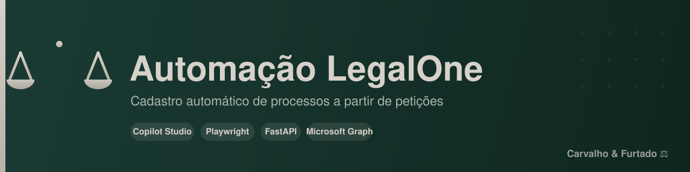
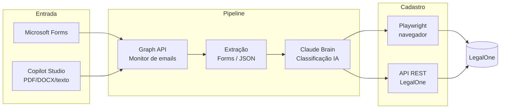

<div align="center">



<br/><br/>

**Cadastro automático de processos judiciais no LegalOne a partir de petições.**

Recebe dados via Microsoft Forms ou agente Copilot Studio, classifica com IA e cadastra no LegalOne via navegador (Playwright) ou API REST.

[](https://www.python.org/)
[](https://playwright.dev/python/)
[](https://fastapi.tiangolo.com/)
[](https://github.com/PaolloSc/automacao-legalone/actions/workflows/ci.yml)
[](LICENSE)
[](https://github.com/astral-sh/ruff)

</div>

---

## 📑 Índice

- [Visão Geral](#-visão-geral)
- [Arquitetura](#-arquitetura)
- [Duas Opções de Entrada](#-duas-opções-de-entrada)
- [Tipos de Cadastro](#-tipos-de-cadastro)
- [Setup](#-setup)
- [Variáveis de Ambiente](#-variáveis-de-ambiente)
- [Estrutura do Projeto](#-estrutura-do-projeto)
- [Testes](#-testes)
- [Segurança & LGPD](#-segurança--lgpd)
- [Licença](#-licença)

---

## 🎯 Visão Geral

O gargalo do cadastro de processos é a **entrada manual de dados**. Este projeto automatiza todo o fluxo: do recebimento dos dados da petição até o cadastro final no LegalOne, com classificação inteligente do tipo de tarefa pelo caminho.

| Antes | Depois |
|-------|--------|
| Advogado preenche formulário manualmente | Envia PDF/DOCX ou conversa com o agente |
| Operador copia dados pro LegalOne | Bot cadastra sozinho |
| Sem classificação | IA identifica tipo de tarefa |
| ~15 min por processo | ~2 min, sem intervenção |

---

## 🏗 Arquitetura



**Fluxo resumido:**

1. **Entrada** — Microsoft Forms **ou** agente Copilot Studio (chat aceita PDF/DOCX/DOC/texto)
2. **Monitor** — `outlook_monitor_graph.py` lê emails via Microsoft Graph API
3. **Extração** — `forms_extractor.py` (Forms) ou JSON direto (Copilot)
4. **Classificação** — `claude_brain.py` identifica o tipo de tarefa
5. **Cadastro** — `legalone_cadastro.py` (Playwright) ou `legalone_api_cadastro.py` (REST)

---

## 🔀 Duas Opções de Entrada

<table>
<tr>
<th>Opção A — Copilot Studio</th>
<th>Opção B — Webhook OCR</th>
</tr>
<tr>
<td>

Agente extrai campos via LLM, advogado revisa no chat, Power Automate envia email estruturado para o bot.

**Vantagem:** interface conversacional, zero código pro usuário final.

📄 [`docs/COPILOT_AGENTE.md`](docs/COPILOT_AGENTE.md)

</td>
<td>

`peticao_api.py` (FastAPI) recebe PDF/DOCX/DOC → Azure Document Intelligence (OCR) → Groq Llama (extração) → cadastro direto.

**Vantagem:** elimina dependência de email, totalmente automático.

</td>
</tr>
</table>

---

## 📋 Tipos de Cadastro

Suporta 5 tipos, cada um com seus campos específicos (ver [`forms_mapping.py`](forms_mapping.py)):

| Tipo | Descrição |
|------|-----------|
| 🟢 `CADASTRO INICIAL` | Processo novo |
| 🔵 `DECISOES` | Decisão em processo existente |
| 🟡 `RECURSO` | Interposição de recurso |
| ⚫ `ARQUIVAMENTO COMPLETO` | Encerramento total |
| ⚪ `ARQUIVAMENTO SIMPLES` | Baixa administrativa |

---

## 🚀 Setup

```bash
# 1. Instalar dependências
pip install -r requirements.txt
playwright install chromium

# 2. Configurar credenciais
cp .env.example .env
# editar .env com seus valores

# 3. Rodar
python automacao_legalone_completa.py
```

> [!TIP]
> Para a **Opção B** (webhook OCR), suba a API com:
> ```bash
> uvicorn peticao_api:app --host 0.0.0.0 --port 8000
> ```

---

## 🔑 Variáveis de Ambiente

Ver [`.env.example`](.env.example). Principais:

| Variável | Uso |
|----------|-----|
| `LEGALONE_USERNAME` / `LEGALONE_PASSWORD` | Login LegalOne |
| `AZURE_TENANT_ID` / `AZURE_CLIENT_ID` / `AZURE_CLIENT_SECRET` | Graph API (emails) |
| `GROQ_API_KEY` | Extração via LLM (grátis) |
| `FIRECRAWL_API_KEY` | Scraping Forms (opcional) |
| `AZURE_DOC_INTELLIGENCE_*` | OCR Opção B |
| `DATAJUD_API_KEY` | Override da chave pública do CNJ (opcional) |

> [!WARNING]
> Nunca commite o `.env`. Ele está no `.gitignore` por padrão.

---

## 📂 Estrutura do Projeto

```
.
├── automacao_legalone_completa.py   # 🎯 Orquestrador principal
├── outlook_monitor_graph.py         # 📧 Monitor de emails (Graph API)
├── forms_extractor.py               # 📝 Extração do Microsoft Forms
├── forms_mapping.py                 # 🗺  Mapeamento de campos por tipo
├── claude_brain.py                  # 🧠 Classificação por IA
├── legalone_cadastro.py             # 🌐 Cadastro via Playwright
├── legalone_api_cadastro.py         # 🔌 Cadastro via API REST
├── peticao_api.py                   # 📤 Webhook OCR (Opção B)
├── peticao_extractor.py             # 🔍 OCR + extração (Opção B)
├── config_azure.py                  # ⚙  Config Azure
├── docs/
│   └── COPILOT_AGENTE.md            # 📖 Doc do agente Copilot Studio
└── tests/                           # ✅ Suíte de testes
```

---

## ✅ Testes

```bash
pytest
```

A CI roda `pytest` + `ruff` em cada push (ver [`.github/workflows/ci.yml`](.github/workflows/ci.yml)).

---

## 🔒 Segurança & LGPD

- `.env`, logs e screenshots **nunca** são versionados (ver [`.gitignore`](.gitignore))
- Dados de processos contêm informação de clientes — não commitar
- Sessões do navegador (`browser_data/`) contêm login autenticado — não commitar
- Chaves de API lidas via variável de ambiente, nunca hardcoded

---

## 📜 Licença

Distribuído sob a licença MIT. Ver [`LICENSE`](LICENSE).

<div align="center">
<sub>Feito para o escritório <b>Carvalho & Furtado</b> ⚖️</sub>
</div>
